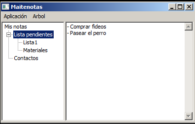

# maitenotas
Little journal software to help you safely store (with encryption) important and personal text notes.

## why another journal software?
Because I couldn't find one that meets my needs for a journal software, which are:
- Free now and forever
- Open source with Python (so it is easy to modify/enhance)
- Use encryption by default
- Cross platform
- Small and quick and portable (just copy .exe anywhere you want and use it)
- Supports accessibility (can be used with screen readers)
- Does not use electron

So I created one.

## A screenshot (running in Windows, but can be compiled to run anywhere Python desktop software runs)

## Extra notes
- This application was created during a weekend so do not expect any coding or best practices. It is just a simple personal utility I created for my personal use, but I think it could be useful for others also so here it is.
- Send PRs or comments to help improve it! Share it with your friends!
- If you just need the compiled binary .exe for windows [here it is](https://file.io/0iJbYAmF3QU0) if that link fails here is a mirror, it is a zip file with the password "manzana", unzip it and then rename the file adding the .exe extension (some hostings have trouble sharing exe file, so this measures are needed) [zip version](https://drive.google.com/drive/folders/1CLAlq2qLwk6OEceJuhWfrrt0XylweTwd?usp=sharing)
- The name "maitenotas" is the union of [Maiten tree of Argentina](https://en.wikipedia.org/wiki/Maytenus_boaria) and "notas" (notes in spanish). Basically: "notes in a tree".

## License
GPL. It is free, open source, if you use any of this code keep your project also open source and keep all references to sources.
